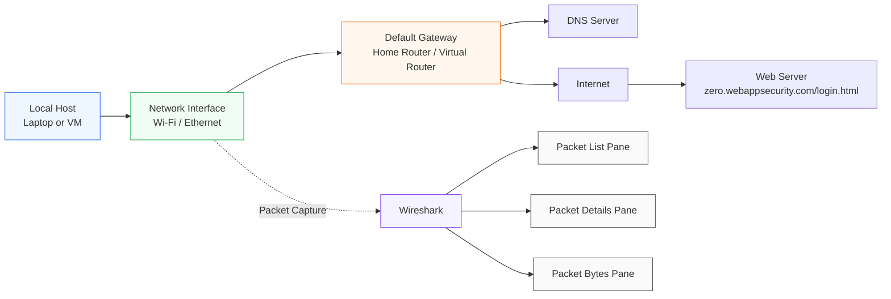
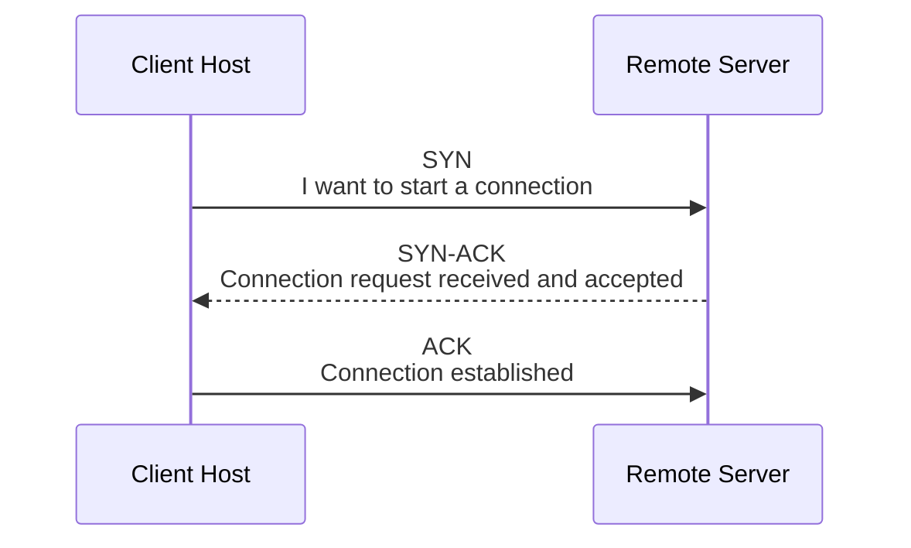
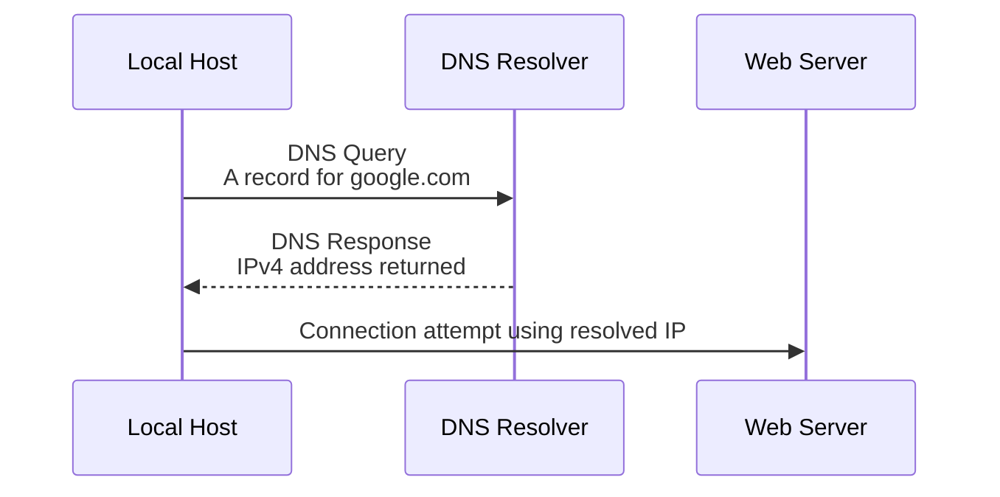
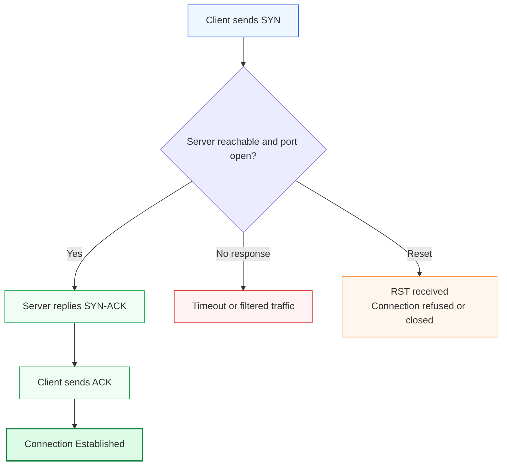
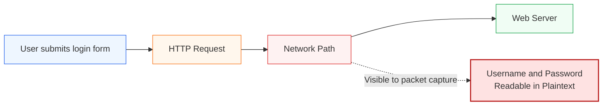
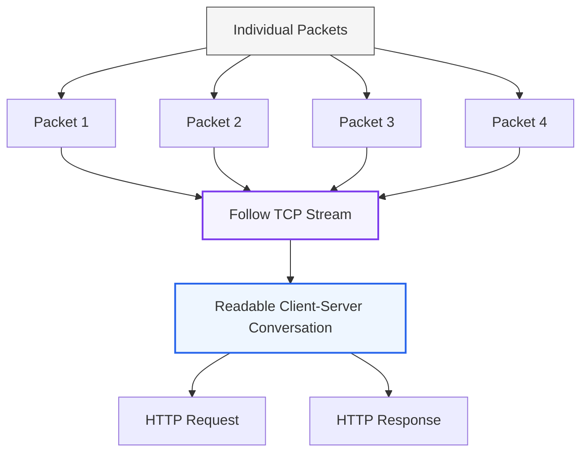

# Lab 2 — 🦈 Wireshark & Network Analysis


## Watch Me Build This Lab Here!
https://www.loom.com/share/c895b408403a42febe8491ad56df655b

## Executive Summary

This lab demonstrates foundational packet analysis skills using **Wireshark**, a free and open-source network protocol analyzer used by network engineers, SOC analysts, cloud security engineers, help desk technicians, and incident responders.

The purpose of this lab was to capture and analyze live network traffic, identify core protocols, inspect packet behavior, and explain how packet-level visibility supports troubleshooting, security investigations, and cloud network operations.

In this lab, I analyzed:

- DNS queries and responses
- TCP three-way handshakes
- HTTP traffic
- Cleartext credential exposure over unencrypted HTTP
- TCP stream reconstruction
- Wireshark display filters
- Saved packet capture files in `.pcapng` format

This project strengthens my understanding of how data moves across a network and how packet captures can be used to troubleshoot connectivity problems, validate security concerns, and investigate suspicious traffic.

---

## Certification and Career Alignment

| Area | Relevance |
|---|---|
| CompTIA Network+ | Protocol analysis, TCP/IP, DNS, ports, traffic flow |
| CompTIA Security+ | Secure protocols, credential exposure, packet inspection, risk identification |
| CompTIA CySA+ | Network indicators, traffic investigation, anomaly detection |
| SOC Analyst | Reviewing packets for suspicious behavior and indicators of compromise |
| Cloud Security Engineer | Understanding how packet analysis maps to Azure Network Watcher, NSG flow logs, packet captures, and cloud diagnostics |
| Systems Administrator | Troubleshooting DNS, connectivity, web traffic, and endpoint communication issues |

---

## The Business Problem This Lab Solves

Modern organizations depend on networks for nearly every business function: authentication, email, database queries, web applications, file transfers, API calls, cloud services, and remote access.

When a service is unreachable, a user reports slowness, DNS fails, a firewall blocks traffic, or a security alert fires, the network is often part of the investigation. Logs can tell part of the story, but packet captures show what actually happened on the wire.

Wireshark allows analysts and engineers to inspect traffic at the packet level, helping answer questions such as:

- Did the client send the request?
- Did the server respond?
- Did DNS resolve correctly?
- Was the TCP connection established?
- Was traffic encrypted or sent in cleartext?
- Was data exposed over the network?
- Did a connection reset or timeout occur?

This lab builds the packet analysis foundation needed for real-world troubleshooting, security monitoring, and cloud network operations.

---

## 🛠️ Tools and Environment

| Component | Details |
|---|---|
| Tool | Wireshark |
| Capture Format | `.pcapng` |
| Host Machine | macOS |
| Network Interface | Wi-Fi |
| Test Domains | `google.com`, `zero.webappsecurity.com/login.html` |
| Protocols Analyzed | DNS, TCP, HTTP, ICMP |
| Command-Line Tools | `nslookup`, optional `tshark` |
| Cost | $0 |

---

## Repository Structure

```text
wireshark-network-analysis-lab/
│
├── README.md
├── screenshots/
│   ├── 01-wireshark-interface.png
│   ├── 02-dns-query-google.png
│   ├── 03-dns-response-google.png
│   ├── 04-tcp-three-way-handshake.png
│   ├── 05-http-request.png
│   ├── 06-follow-tcp-stream.png
│   └── 07-saved-pcap-file.png
│
├── captures/
│   ├── dns-analysis.pcapng
│   ├── tcp-handshake.pcapng
│   └── http-cleartext-demo-sanitized.pcapng
│
└── notes/
    ├── display-filters.md
    ├── troubleshooting-notes.md
    └── lessons-learned.md
```

> Security note: Do not upload packet captures containing real passwords, session cookies, tokens, private IP details from an employer network, or sensitive personal data. Use sanitized captures created in a home lab or test environment.

---

# Network Capture Architecture

The diagram below shows the basic traffic flow from a local host to the internet and how Wireshark captures packets from the selected network interface.


> This diagram shows how traffic flows from external network resources through the local network interface into Wireshark, where packets can be captured, filtered, analyzed, and exported as evidence for troubleshooting or security investigation.

## Important Capture Clarification

Promiscuous mode allows a network interface to receive packets not specifically addressed to its MAC address. However, on most modern switched networks, Wireshark will usually only capture:

- Traffic to and from the local host
- Broadcast traffic
- Multicast traffic
- Traffic forwarded to the capture port

To capture traffic from other devices, an engineer typically needs one of the following:

- Switch port mirroring / SPAN
- A network tap
- A hub-based test network
- Virtual switch configuration in a hypervisor or cloud lab
- Permissioned packet capture from the target system

This distinction matters because packet visibility depends on the network architecture.

---

# Core Concepts

## What Is a Packet?

A packet is a small unit of data transmitted across a network. When a user loads a webpage, sends an email, or connects to an application, the data is broken into smaller packets. Each packet contains headers with routing and protocol information, plus a payload containing the data being transmitted.

Wireshark captures and displays these packets so analysts can inspect the source, destination, protocol, flags, ports, timing, and payload details.

## What Is a Network Protocol?

A protocol is a set of rules that defines how systems communicate. Common protocols include:

| Protocol | Purpose |
|---|---|
| DNS | Resolves domain names to IP addresses |
| TCP | Provides reliable connection-based communication |
| HTTP | Transfers unencrypted web content |
| HTTPS | Transfers encrypted web content using TLS |
| ICMP | Supports network diagnostics such as ping |

## What Is DNS?

DNS, or Domain Name System, translates human-readable domain names such as `google.com` into IP addresses that computers use to communicate.

Before a browser connects to a website, the system usually performs a DNS lookup. If DNS fails, users may not be able to access websites, applications, email services, or cloud resources even when the network connection itself is working.

## What Is the TCP Three-Way Handshake?

TCP uses a three-step process to establish a connection between two systems.



If the SYN packet is sent but no SYN-ACK is returned, the server may be unreachable, blocked by a firewall, or not listening on the requested port. If a RST packet appears, the connection may have been refused or forcibly closed.

## HTTP vs HTTPS

HTTP sends web traffic in cleartext. This means form submissions, usernames, passwords, cookies, and other sensitive data may be readable in a packet capture.

HTTPS protects the HTTP payload using TLS encryption. Wireshark can still show metadata such as IP addresses, ports, TLS handshakes, and certificate-related details, but the application payload is encrypted.

---

# Lab Objectives

By completing this lab, I demonstrated the ability to:

- Capture live network traffic using Wireshark
- Identify DNS queries and responses
- Analyze a TCP three-way handshake
- Use display filters to isolate relevant traffic
- Identify unencrypted HTTP requests
- Demonstrate the risk of cleartext credential exposure
- Reconstruct a full TCP stream
- Save and reopen packet capture files
- Document technical findings in a portfolio-ready format

---

# Step 1 — Install Wireshark

Wireshark is free and open source. It can be installed on Windows, macOS, or Linux.

| Operating System | Installation Notes |
|---|---|
| Windows | Download the Windows x64 installer and install Npcap when prompted |
| macOS | Download the macOS installer and allow capture permissions when prompted |
| Linux | Install with the package manager and configure capture permissions |

Follow link to download https://wireshark.org/

Linux example:

```bash
sudo apt install wireshark
sudo usermod -aG wireshark $USER
wireshark --version
```

---

# Step 2 — Capture Live Traffic

I opened Wireshark and selected the active network interface with visible traffic activity.

After starting the capture, I generated traffic by opening a browser and visiting a test website. After approximately 30 seconds, I stopped the capture and reviewed the packet list.

## Screenshot Evidence


> Wireshark capturing live traffic on the active network interface.

## Observation

A short browsing session generated a large number of packets. This showed why display filters are necessary when analyzing production traffic, where captures can contain thousands or millions of packets.

---

# Step 3 — Essential Wireshark Display Filters

Display filters allow an analyst to isolate specific traffic after the capture has already been collected. This is different from capture filters, which limit what is recorded before capture begins.

For this lab, I used display filters so I could view the same packet capture through different investigative lenses.

| Display Filter | Purpose |
|---|---|
| `dns` | Shows DNS queries and responses |
| `http` | Shows unencrypted HTTP traffic |
| `tcp` | Shows all TCP traffic |
| `icmp` | Shows ping and ICMP diagnostic traffic |
| `tcp.flags.syn == 1` | Shows TCP SYN packets and connection attempts |
| `tcp.flags.reset == 1` | Shows TCP reset packets |
| `ip.addr == x.x.x.x` | Shows traffic to or from a specific IP address |
| `ip.src == x.x.x.x` | Shows traffic from a specific source IP |
| `tcp.port == 443` | Shows HTTPS traffic by TCP port |
| `http.request` | Shows HTTP requests |
| `http.request.method == POST` | Shows HTTP POST requests |

---

# Exercise A — Capture and Analyze a DNS Lookup

## Objective

Capture a DNS lookup and identify the query and response packets in Wireshark.

## Process

1. Started a Wireshark capture on the active network interface.
2. Opened a separate terminal window.
3. Ran the following command:

```bash
nslookup google.com
```


4. Stopped the Wireshark capture.
5. Applied the display filter:

```text
dns
```


6. Located the DNS query for `google.com`.
7. Located the DNS response containing the returned IP address.
8. Expanded the DNS response details and reviewed the Answers section.

## DNS Lookup Flow



## Screenshot Evidence


> DNS query showing the local host requesting the A record for `google.com`.

## Findings

During the DNS capture, I observed my host sending a query for the A record of `google.com`. The DNS server responded with one or more IPv6 addresses. This confirmed that name resolution occurred before the host attempted to communicate with the destination server.

## Real-World Relevance

DNS analysis is important because many network and security incidents involve domain lookups. Suspicious DNS queries can indicate malware beaconing, command-and-control communication, phishing infrastructure, or misconfigured systems attempting to reach invalid domains.

---

# Exercise B — Analyze the TCP Three-Way Handshake

## Objective

Identify the TCP three-way handshake used to establish a web connection.

## Process

1. Started a new Wireshark capture.
2. Opened a browser and navigated to:

```text
http://example.com
```

3. Stopped the capture.
4. Used `nslookup` to identify the IP address for `zero.webappsecurity.com/login.html`.
5. Applied a filter similar to:

```text
tcp and ip.addr == <zero.webappsecurity.com/login.html IP address>
```

6. Identified the three handshake packets:

| Packet | TCP Flag | Meaning |
|---|---|---|
| 1 | SYN | Client requests a connection |
| 2 | SYN-ACK | Server acknowledges and accepts the connection request |
| 3 | ACK | Client confirms and establishes the connection |

## TCP Handshake Visual



## Screenshot Evidence


> TCP three-way handshake showing SYN, SYN-ACK, and ACK packets between the local host and remote web server.

## Findings

I identified the TCP three-way handshake between my local machine and the remote server. The SYN packet initiated the connection, the SYN-ACK packet confirmed that the server was reachable and listening, and the final ACK completed the connection setup.

## Troubleshooting Value

The TCP handshake is one of the fastest ways to determine where a connectivity problem may exist:

| Packet Pattern | Likely Meaning |
|---|---|
| SYN, SYN-ACK, ACK | Connection succeeded |
| SYN only, repeated | Server unreachable, firewall filtering, or dropped traffic |
| SYN followed by RST | Port closed or connection refused |
| Delayed SYN-ACK | Network latency or server delay |

---

# Exercise C — Identify Cleartext Credentials in HTTP

## Ethical Scope

This exercise must only be performed in a lab environment, on systems I own, or on systems where I have explicit permission to test. Capturing credentials from unauthorized networks or systems is unethical and illegal.

## Objective

Demonstrate why HTTP is insecure for login forms and sensitive data transmission.

## Process

1. Set up or accessed a test HTTP login form.
2. Started a Wireshark capture.
3. Submitted test credentials over HTTP.
4. Stopped the capture.
5. Applied the display filter:

```text
http.request.method == POST
```

6. Selected the HTTP POST packet.
7. Reviewed the packet details and located the form data.

## HTTP Cleartext Risk Visual



## Screenshot Evidence


> HTTP POST request showing test form data transmitted without encryption.

## Security Finding

The HTTP credential capture demonstrated that unencrypted web traffic can expose sensitive form data in plaintext. In a production environment, this would represent a serious confidentiality risk because credentials, tokens, or user-submitted data could be captured by anyone with visibility into the traffic path.

## Mitigation

Use HTTPS for all web applications that transmit sensitive data. HTTPS protects the HTTP payload by encrypting it with TLS, preventing credentials and other sensitive content from being readable in packet captures.

---

# Exercise D — Follow a Full TCP Stream

## Objective

Reconstruct a full client-server conversation from individual packets.

## Process

1. Captured HTTP traffic.
2. Selected an HTTP packet.
3. Right-clicked the packet.
4. Selected:

```text
Follow > TCP Stream
```

5. Reviewed the reconstructed conversation.

## TCP Stream Reconstruction Visual



## Screenshot Evidence


> Follow TCP Stream view reconstructing the HTTP conversation between client and server.

## Findings

The TCP stream view reassembled individual packets into a readable conversation. This is useful during investigations because individual packets only show fragments of activity, while the TCP stream reveals the broader request and response context.

## Incident Response Relevance

Incident responders use stream reconstruction to answer questions such as:

- What request did the client send?
- What did the server return?
- Was sensitive data transmitted?
- Was a command or payload delivered?
- Was data exfiltrated?

---

# Step 5 — Save and Export Captures

Packet captures can be saved and reopened for later analysis.


## Save a Capture

```text
File > Save As > .pcapng
```


## Export Only Filtered Packets

```text
Apply display filter > File > Export Specified Packets > Displayed
```

## Reopen a Capture

```text
File > Open > Select .pcapng file
```

## Optional Command-Line Capture with Tshark

```bash
tshark -i eth0 -w capture.pcapng -c 1000
```

| Option | Meaning |
|---|---|
| `-i eth0` | Capture on interface `eth0` |
| `-w capture.pcapng` | Write capture to a file |
| `-c 1000` | Stop after 1,000 packets |

> Saved `.pcapng` capture files organized for later review and portfolio documentation.

---

# Verification Checklist

| Skill | Verification Method | Completed |
|---|---|---|
| Capture live traffic | Started capture on active interface and generated web traffic | ☐ |
| Analyze DNS | Identified DNS query and response packets | ☐ |
| Analyze TCP handshake | Found SYN, SYN-ACK, and ACK packets | ☐ |
| Use display filters | Filtered by protocol, IP address, port, and HTTP method | ☐ |
| Identify HTTP cleartext | Located test form data in an HTTP POST request | ☐ |
| Follow TCP stream | Reconstructed a full HTTP conversation | ☐ |
| Save capture | Saved and reopened `.pcapng` file | ☐ |
| Document findings | Added screenshots, observations, and security analysis | ☐ |

---

# Troubleshooting Notes

| Issue | Likely Cause | Fix |
|---|---|---|
| No packets visible | Wrong interface selected | Select the Wi-Fi or Ethernet adapter showing active traffic |
| DNS packets not visible | DNS result was cached | Use `nslookup` to force a new DNS query |
| HTTP packets hard to find | Most sites use HTTPS by default | Use a controlled HTTP test page or local HTTP lab |
| Cannot capture on Linux | User lacks capture permissions | Add user to the `wireshark` group and log out/in |
| Too many packets | Capture window too long or noisy network | Use display filters to isolate relevant traffic |
| Only seeing local traffic | Normal behavior on switched networks | Use SPAN, port mirroring, a tap, or a controlled lab if broader visibility is required |

---

# Key Takeaways

1. DNS resolution usually occurs before web connections are established.
2. TCP connections begin with a three-way handshake: SYN, SYN-ACK, ACK.
3. Wireshark display filters are essential for analyzing large packet captures.
4. HTTP transmits data in cleartext and should not be used for sensitive information.
5. HTTPS protects web payloads by encrypting traffic with TLS.
6. TCP stream reconstruction helps analysts understand complete client-server conversations.
7. Packet captures provide evidence that can support troubleshooting, incident response, and security investigations.

---

# Security Lessons Learned

This lab demonstrated that network traffic can reveal sensitive information when insecure protocols are used. HTTP traffic is readable in Wireshark because it lacks encryption. In a professional environment, this reinforces the need for:

- HTTPS enforcement
- Secure application configuration
- TLS certificate management
- Strong credential handling
- Network segmentation
- Monitoring for unusual DNS and outbound traffic
- Careful handling of packet capture files

Packet captures should be treated as sensitive artifacts because they may contain usernames, hostnames, internal IP addresses, cookies, tokens, session data, or other confidential information.

---

# How This Applies to Cloud Engineering

Although Wireshark is often used on local networks, the packet analysis mindset transfers directly into cloud environments.

| Wireshark Skill | Cloud Equivalent |
|---|---|
| Packet capture | Azure Network Watcher packet capture |
| Protocol filtering | NSG flow log analysis |
| DNS troubleshooting | Azure DNS and private DNS zone troubleshooting |
| TCP handshake analysis | Testing service reachability across subnets and firewalls |
| Traffic inspection | Cloud security monitoring and incident investigation |
| HTTP vs HTTPS analysis | Application Gateway, TLS, WAF, and secure web app configuration |

Cloud engineers still need to understand packets because cloud networking problems often involve the same fundamentals: DNS, ports, protocols, routes, security rules, and encrypted traffic.

---

# Portfolio Summary

This project demonstrates hands-on packet analysis using Wireshark. I captured live network traffic, isolated specific protocols using display filters, analyzed DNS resolution, identified TCP connection establishment, inspected HTTP traffic, demonstrated the risk of cleartext credentials, and reconstructed full TCP streams.

The lab strengthened my understanding of network troubleshooting, secure protocol usage, and the relationship between endpoint packet captures and cloud network diagnostics.
